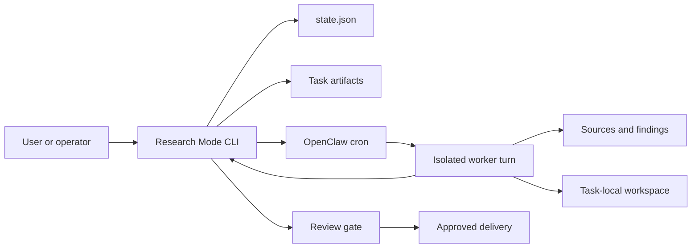
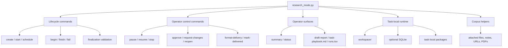
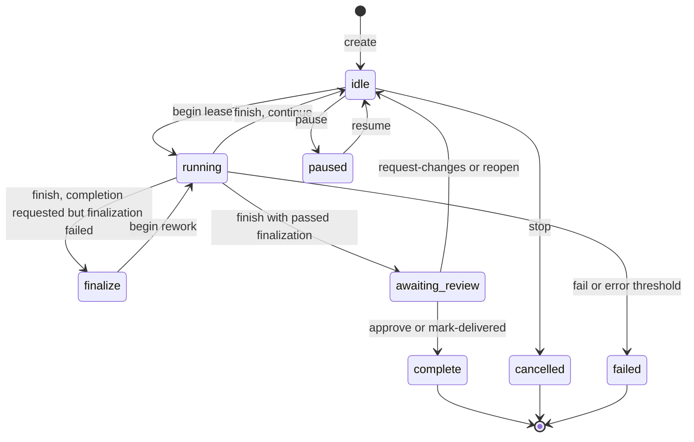
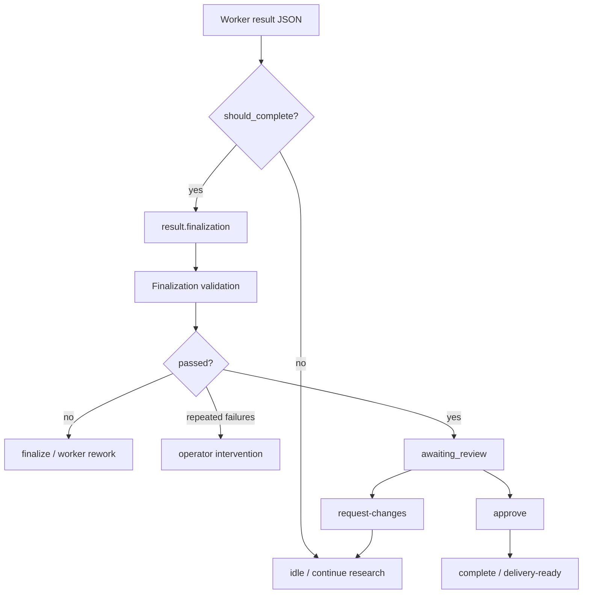
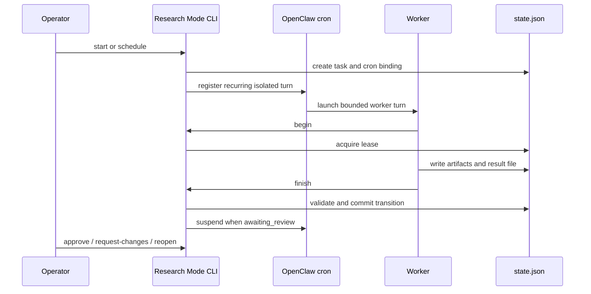
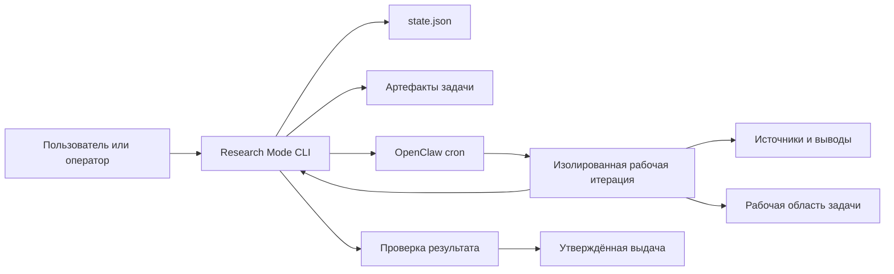
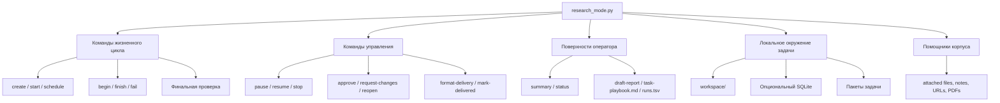

# Research Mode Architecture

[English](#english) | [Русский](#русский)

`research-mode` is a durable research control plane for OpenClaw. It turns a
large research goal into bounded worker iterations, keeps task state and
artifacts on disk, and blocks user-facing delivery until a reviewable final
candidate exists.

It is better than simpler alternatives for long-running, evidence-heavy work
because it combines scheduled continuation, local auditability, explicit review
gates, and finalization checks. It is distributed as an OpenClaw skill package,
not as a standalone Python daemon. It is not meant to replace one-shot chat,
interactive notebooks, or custom domain pipelines when those are enough.

## English

## System Overview

Research Mode has three layers:

- **OpenClaw execution layer** schedules isolated worker turns through cron.
- **Research Mode control plane** owns task state transitions and validation.
- **Task workspace** stores sources, findings, iteration notes, runtime outputs,
  candidate deliverables, and final reports.



The helper scripts are deterministic state-management tools. The autonomous
research behavior comes from OpenClaw workers using those tools repeatedly on a
schedule.

## Core Components



Main files:

- `research_mode.py` — CLI entrypoint and command routing.
- `research_mode_lifecycle_commands.py` — `begin`, `finish`, `fail`, and
  lifecycle state transitions.
- `research_mode_payloads.py` — task and worker result payload contracts.
- `research_mode_finalization.py` — finalization surface and operator next
  action calculation.
- `research_mode_surfaces.py` / `research_mode_reporting.py` — human-readable
  and JSON operator views.
- `research_mode_runtime.py` — OpenClaw cron integration and task-local runtime
  preparation.
- `research_mode_task.py` — task paths, state files, append-only run artifacts.

## Data Model

Each task is a directory under a selected research root.

```text
research/
  demo-task/
    state.json
    sources.jsonl
    findings.jsonl
    runs.tsv
    final-report.md
    task-playbook.md
    iterations/
    workspace/
      analysis/
      tools/
      data/
      outputs/
```

`state.json` is the control plane. It records task status, working memory,
current lock, cron binding, finalization state, review state, delivery state,
and transition history.

Append-only files such as `sources.jsonl`, `findings.jsonl`, and iteration
notes preserve a reviewable trail. The task-local `workspace/` is available for
scripts, SQLite, temporary analysis, screenshots, exports, and derived outputs.

## Lifecycle



A worker iteration is intentionally bounded:

1. `begin` acquires a lease and returns a work order.
2. The worker performs one focused research step.
3. The worker writes a result JSON file.
4. `finish` validates and commits the state transition.
5. `fail` records errors when a leased iteration breaks.

This prevents one long assistant session from becoming the only source of truth.

## Finalization and Review Gate



Worker-initiated completion requires `result.finalization.status="passed"`,
non-empty validation evidence, no blocking defects, and inspectable candidate
artifacts. `awaiting_review` means a candidate is ready for human review. It
does not mean the result was already delivered.

The operator-facing finalization surface exposes `operator_next_action`:

- `review_candidate`
- `worker_rework`
- `operator_intervention`
- `verify_review_state`
- `continue_research`

This makes the next action explicit instead of requiring the operator to infer
intent from raw JSON.

## OpenClaw Cron Integration



The project deliberately depends on OpenClaw cron for scheduling, isolation,
owner-channel updates, pause/resume/stop behavior, and review handoff. The
Python scripts can be run manually, but they are not a standalone scheduler.

## Why This Architecture Is Better For Durable Research

The important comparison is not "better at everything". Research Mode is better
for a specific class of tasks: long-running, evidence-heavy, revisable research
where losing state or delivering an unchecked draft is costly.

| Alternative category | Typical weakness | Research Mode advantage |
| --- | --- | --- |
| One-shot chat answer | Loses continuity and evidence trail after one response. | Persistent state, sources, findings, iteration notes, and resumable work. |
| Manual notebook workflow | Accurate but operator-heavy and easy to leave undocumented. | Structured task lifecycle plus task-local code/data workspace. |
| Generic scheduled prompt | Can repeat work without strong state contracts. | Lease-based `begin`/`finish`, normalized statuses, and committed transitions. |
| Autonomous agent loop | May run too long, drift, or deliver raw artifacts as final. | Bounded iterations, review gates, finalization trace, and artifact inspection. |
| Standalone scraper/RAG pipeline | Strong ingestion, weaker human review and delivery workflow. | Operator surfaces, review/rework loop, delivery formatting, and follow-up tasks. |

Research Mode is not always the right tool. Use simpler tools when the task is a
quick lookup, a one-turn summary, an ordinary coding change, or a tightly scoped
data pipeline that already has its own scheduler and review process.

## Design Principles

- **Durability over prompt length.** State lives on disk, not only inside a chat.
- **Bounded work over endless autonomy.** Each cron turn does one manageable
  iteration.
- **Explicit transitions over hand-edited JSON.** Helpers own state mutation.
- **Review before delivery.** `awaiting_review` is a gate, not a final state.
- **Inspectable artifacts.** Candidate deliverables must be task-local and
  structurally readable.
- **Operator clarity.** `summary`, `status`, `task-playbook.md`, and
  `operator_next_action` make the current situation visible.
- **OpenClaw-native scheduling.** Cron and isolated turns are part of the
  product model, not incidental implementation detail.

## Русский

## Обзор системы

Research Mode состоит из трёх слоёв:

- **Слой выполнения OpenClaw** запускает изолированные рабочие итерации через cron.
- **Управляющий слой Research Mode** управляет состоянием, переходами и проверками.
- **Рабочая область задачи** хранит источники, выводы, заметки итераций,
  выводы локального окружения, кандидатные материалы и финальные отчёты.



Вспомогательные скрипты — это детерминированные инструменты управления
состоянием. Автономное исследовательское поведение появляется за счёт рабочих
итераций OpenClaw, которые используют эти инструменты по расписанию.

## Основные компоненты



Главные файлы:

- `research_mode.py` — CLI-точка входа и маршрутизация команд.
- `research_mode_lifecycle_commands.py` — `begin`, `finish`, `fail` и переходы
  жизненного цикла.
- `research_mode_payloads.py` — контракты задачи и JSON-результата рабочей итерации.
- `research_mode_finalization.py` — поверхность финальной проверки и расчёт следующего
  действия оператора.
- `research_mode_surfaces.py` / `research_mode_reporting.py` — представления для оператора в
  JSON и человекочитаемом виде.
- `research_mode_runtime.py` — интеграция с OpenClaw cron и локальное окружение задачи.
- `research_mode_task.py` — пути задач, файлы состояния и append-only артефакты запусков.

## Модель данных

Каждая задача — директория внутри выбранного корня исследований.

```text
research/
  demo-task/
    state.json
    sources.jsonl
    findings.jsonl
    runs.tsv
    final-report.md
    task-playbook.md
    iterations/
    workspace/
      analysis/
      tools/
      data/
      outputs/
```

`state.json` — управляющий файл задачи. Там хранятся статус задачи, рабочая
память, активная блокировка, привязка к cron, состояние финальной проверки,
состояние ревью, состояние выдачи и история переходов.

Файлы с дозаписью вроде `sources.jsonl`, `findings.jsonl` и заметок итераций
оставляют проверяемый след. Локальный `workspace/` задачи нужен для скриптов,
SQLite, временного анализа, скриншотов, экспортов и производных результатов.

## Жизненный цикл


Рабочая итерация намеренно ограничена:

1. `begin` берёт блокировку и возвращает задание на работу.
2. Исполнитель делает один сфокусированный шаг исследования.
3. Исполнитель пишет JSON-результат.
4. `finish` проверяет результат и фиксирует переход состояния.
5. `fail` фиксирует ошибку, если итерация с блокировкой сломалась.

Так одна длинная сессия ассистента не становится единственным источником
правды.

## Финальная проверка и ревью


Завершение, инициированное рабочей итерацией, требует
`result.finalization.status="passed"`, непустых доказательств проверки,
отсутствия блокирующих дефектов и кандидатных артефактов, которые можно
посмотреть. `awaiting_review` означает, что кандидат готов к проверке человеком.
Это ещё не означает, что результат доставлен пользователю.

Поверхность финальной проверки показывает `operator_next_action`:

- `review_candidate`
- `worker_rework`
- `operator_intervention`
- `verify_review_state`
- `continue_research`

Оператор видит следующий шаг явно, а не реконструирует намерение по сырому JSON.

## Интеграция с OpenClaw cron


Проект осознанно зависит от OpenClaw cron: расписание, изоляция, обновления в
канале владельца, поведение `pause` / `resume` / `stop` и передача на ревью
находятся на этом слое. Python-скрипты можно запускать вручную, но это не
самостоятельный планировщик.

## Почему эта архитектура лучше для длительных исследований

Правильное сравнение не "лучше во всём". Research Mode лучше для класса задач,
где исследование длится несколько итераций, важны проверяемый след, ревью,
повторяемость и аккуратная доставка.

| Категория альтернатив | Типичная слабость | Преимущество Research Mode |
| --- | --- | --- |
| Одноразовый ответ в чате | Теряет контекст и проверяемый след после одного ответа. | Состояние на диске, источники, выводы, заметки итераций и возможность продолжить работу. |
| Ручной процесс в notebook | Точный, но требует много ручной дисциплины и легко остаётся недокументированным. | Структурированный жизненный цикл плюс локальная рабочая область для кода и данных. |
| Обычная инструкция по расписанию | Может повторять работу без строгого контракта состояния. | `begin`/`finish` с блокировкой, нормализованные статусы и фиксируемые переходы. |
| Автономный цикл агента | Может дрейфовать, работать слишком долго или выдать сырые артефакты как финал. | Ограниченные итерации, ревью, след финальной проверки и проверка артефактов. |
| Отдельный scraper/RAG pipeline | Силен в сборе данных, но слабее в ревью человеком и выдаче результата. | Поверхности оператора, цикл ревью/доработки, форматирование выдачи и связанные задачи. |

Research Mode не нужен для быстрых поисков, одноразовых сводок, обычных задач
по коду или узких конвейеров данных, у которых уже есть собственные планировщик и
процесс ревью.

## Принципы дизайна

- **Долговечность вместо длинной инструкции.** Состояние живёт на диске, а не только в
  чате.
- **Ограниченная работа вместо бесконечной автономности.** Один запуск cron делает одну
  управляемую итерацию.
- **Явные переходы вместо ручного JSON.** Изменение состояния проходит через
  вспомогательные команды.
- **Ревью перед выдачей.** `awaiting_review` — контрольная точка, а не финальная доставка.
- **Проверяемые артефакты.** Кандидатные материалы должны лежать внутри задачи и
  быть структурно читаемыми.
- **Ясность для оператора.** `summary`, `status`, `task-playbook.md` и
  `operator_next_action` показывают текущую ситуацию.
- **Планирование через OpenClaw.** Cron и изолированные итерации — часть модели
  продукта, а не случайная деталь реализации.
